# 分镜脚本 + AI提示词｜09_7559767287391554851

- 平台：抖音
- 原链接：https://www.douyin.com/video/7559767287391554851
- 本地视频：/Users/mac/Desktop/视频素材/_中转/抖音_203416_7559767287391554851.mp4
- 时长：30.79 秒
- 抽帧规则：每 2 秒 1 帧
- 联系表：contact_sheet.jpg

## 使用说明

- 每个镜头按视频时间顺序排列。
- AI 提示词已按用户规范处理：以 `@xxx` 开头，产品/膏霜位置可复用 `@xxx`，不要求生成字幕，每条结尾明确不要字幕。
- 如需更精细版本，可基于 `frames/` 逐帧二次改写。

## 分镜明细

### 镜头 01｜约 00s｜开场钩子
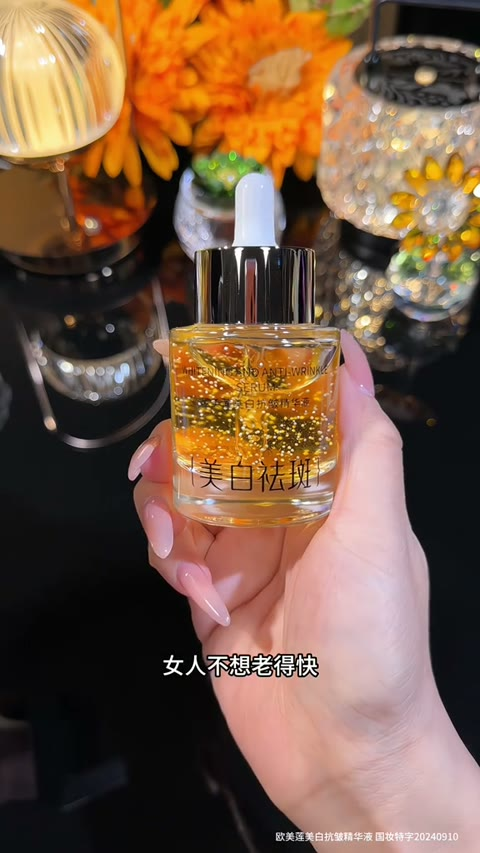

画面描述：用近景快速建立产品/人物/使用场景，画面节奏干净直接，先给观众一个可感知的视觉记忆点。

分镜脚本：开场钩子：用近景快速建立产品/人物/使用场景，画面节奏干净直接，先给观众一个可感知的视觉记忆点。建议保持 1.5-2 秒节奏，动作不要过满，重点放在产品、手部和质感变化上。

AI提示词：@xxx广告开场近景，产品或手部动作进入画面，构图稳定，背景干净，第一秒抓住注意力，竖屏9:16，近景开场，镜头轻微推进，产品/膏霜位置使用@xxx，真实商业美妆短视频风格，高清细节，皮肤质感自然，光线柔和通透，色彩干净高级，背景不杂乱，动作连贯自然，负面：低清晰度、畸形手、过度磨皮、脏乱背景、文字水印、logo乱码、过曝、塑料感。整段视频不要出现任何字幕

### 镜头 02｜约 02s｜开场钩子
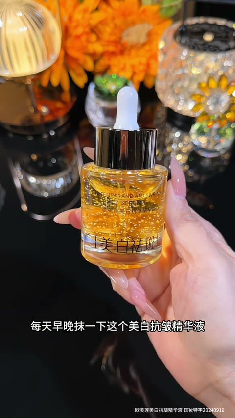

画面描述：用近景快速建立产品/人物/使用场景，画面节奏干净直接，先给观众一个可感知的视觉记忆点。

分镜脚本：开场钩子：用近景快速建立产品/人物/使用场景，画面节奏干净直接，先给观众一个可感知的视觉记忆点。建议保持 1.5-2 秒节奏，动作不要过满，重点放在产品、手部和质感变化上。

AI提示词：@xxx广告开场近景，产品或手部动作进入画面，构图稳定，背景干净，第一秒抓住注意力，竖屏9:16，俯拍或侧拍，构图留白干净，产品/膏霜位置使用@xxx，真实商业美妆短视频风格，高清细节，皮肤质感自然，光线柔和通透，色彩干净高级，背景不杂乱，动作连贯自然，负面：低清晰度、畸形手、过度磨皮、脏乱背景、文字水印、logo乱码、过曝、塑料感。整段视频不要出现任何字幕

### 镜头 03｜约 04s｜产品亮相
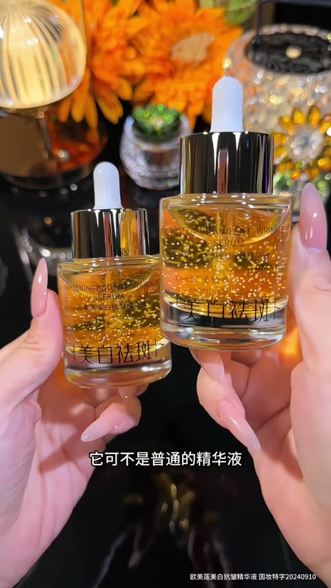

画面描述：镜头聚焦产品外观、瓶身、质地或包装细节，突出卖点物件本身。

分镜脚本：产品亮相：镜头聚焦产品外观、瓶身、质地或包装细节，突出卖点物件本身。建议保持 1.5-2 秒节奏，动作不要过满，重点放在产品、手部和质感变化上。

AI提示词：@xxx产品展示特写，瓶身/膏霜/包装细节清晰，商业棚拍质感，浅景深，干净高级背景，竖屏9:16，微距特写，浅景深，产品/膏霜位置使用@xxx，真实商业美妆短视频风格，高清细节，皮肤质感自然，光线柔和通透，色彩干净高级，背景不杂乱，动作连贯自然，负面：低清晰度、畸形手、过度磨皮、脏乱背景、文字水印、logo乱码、过曝、塑料感。整段视频不要出现任何字幕

### 镜头 04｜约 06s｜产品亮相
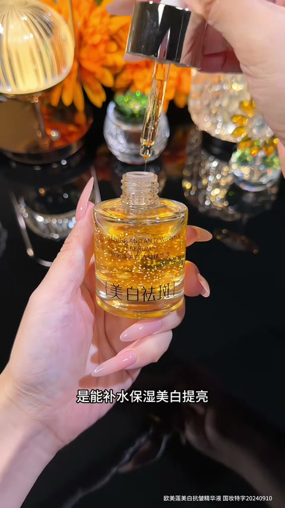

画面描述：镜头聚焦产品外观、瓶身、质地或包装细节，突出卖点物件本身。

分镜脚本：产品亮相：镜头聚焦产品外观、瓶身、质地或包装细节，突出卖点物件本身。建议保持 1.5-2 秒节奏，动作不要过满，重点放在产品、手部和质感变化上。

AI提示词：@xxx产品展示特写，瓶身/膏霜/包装细节清晰，商业棚拍质感，浅景深，干净高级背景，竖屏9:16，中近景，轻微手持运动，产品/膏霜位置使用@xxx，真实商业美妆短视频风格，高清细节，皮肤质感自然，光线柔和通透，色彩干净高级，背景不杂乱，动作连贯自然，负面：低清晰度、畸形手、过度磨皮、脏乱背景、文字水印、logo乱码、过曝、塑料感。整段视频不要出现任何字幕

### 镜头 05｜约 08s｜动作演示
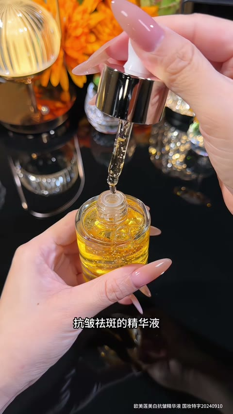

画面描述：通过手部拿取、打开、挤压、涂抹、展示等动作，把产品使用方式讲清楚。

分镜脚本：动作演示：通过手部拿取、打开、挤压、涂抹、展示等动作，把产品使用方式讲清楚。建议保持 1.5-2 秒节奏，动作不要过满，重点放在产品、手部和质感变化上。

AI提示词：@xxx手部操作特写，年轻女性白皙双手自然拿取并使用产品，动作柔和顺滑，真实生活化，竖屏9:16，俯拍或侧拍，构图留白干净，产品/膏霜位置使用@xxx，真实商业美妆短视频风格，高清细节，皮肤质感自然，光线柔和通透，色彩干净高级，背景不杂乱，动作连贯自然，负面：低清晰度、畸形手、过度磨皮、脏乱背景、文字水印、logo乱码、过曝、塑料感。整段视频不要出现任何字幕

### 镜头 06｜约 10s｜动作演示
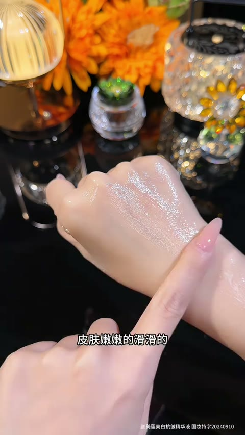

画面描述：通过手部拿取、打开、挤压、涂抹、展示等动作，把产品使用方式讲清楚。

分镜脚本：动作演示：通过手部拿取、打开、挤压、涂抹、展示等动作，把产品使用方式讲清楚。建议保持 1.5-2 秒节奏，动作不要过满，重点放在产品、手部和质感变化上。

AI提示词：@xxx手部操作特写，年轻女性白皙双手自然拿取并使用产品，动作柔和顺滑，真实生活化，竖屏9:16，微距特写，浅景深，产品/膏霜位置使用@xxx，真实商业美妆短视频风格，高清细节，皮肤质感自然，光线柔和通透，色彩干净高级，背景不杂乱，动作连贯自然，负面：低清晰度、畸形手、过度磨皮、脏乱背景、文字水印、logo乱码、过曝、塑料感。整段视频不要出现任何字幕

### 镜头 07｜约 12s｜质地细节
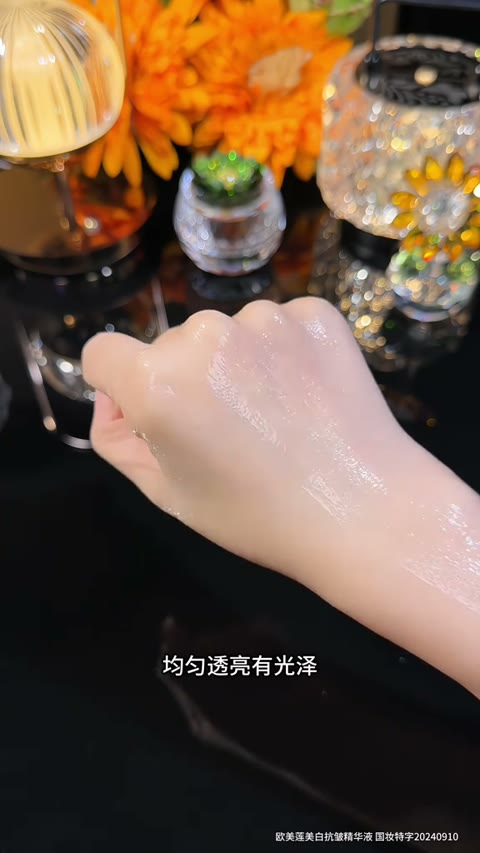

画面描述：放大产品质地、颜色、光泽或上肤效果，突出“看得见”的感官体验。

分镜脚本：质地细节：放大产品质地、颜色、光泽或上肤效果，突出“看得见”的感官体验。建议保持 1.5-2 秒节奏，动作不要过满，重点放在产品、手部和质感变化上。

AI提示词：@xxx微距质地镜头，膏体/液体/粉质细腻可见，柔和高光，干净皮肤纹理，真实美妆广告质感，竖屏9:16，中近景，轻微手持运动，产品/膏霜位置使用@xxx，真实商业美妆短视频风格，高清细节，皮肤质感自然，光线柔和通透，色彩干净高级，背景不杂乱，动作连贯自然，负面：低清晰度、畸形手、过度磨皮、脏乱背景、文字水印、logo乱码、过曝、塑料感。整段视频不要出现任何字幕

### 镜头 08｜约 14s｜质地细节
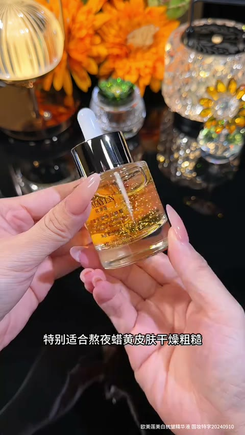

画面描述：放大产品质地、颜色、光泽或上肤效果，突出“看得见”的感官体验。

分镜脚本：质地细节：放大产品质地、颜色、光泽或上肤效果，突出“看得见”的感官体验。建议保持 1.5-2 秒节奏，动作不要过满，重点放在产品、手部和质感变化上。

AI提示词：@xxx微距质地镜头，膏体/液体/粉质细腻可见，柔和高光，干净皮肤纹理，真实美妆广告质感，竖屏9:16，俯拍或侧拍，构图留白干净，产品/膏霜位置使用@xxx，真实商业美妆短视频风格，高清细节，皮肤质感自然，光线柔和通透，色彩干净高级，背景不杂乱，动作连贯自然，负面：低清晰度、畸形手、过度磨皮、脏乱背景、文字水印、logo乱码、过曝、塑料感。整段视频不要出现任何字幕

### 镜头 09｜约 16s｜使用效果
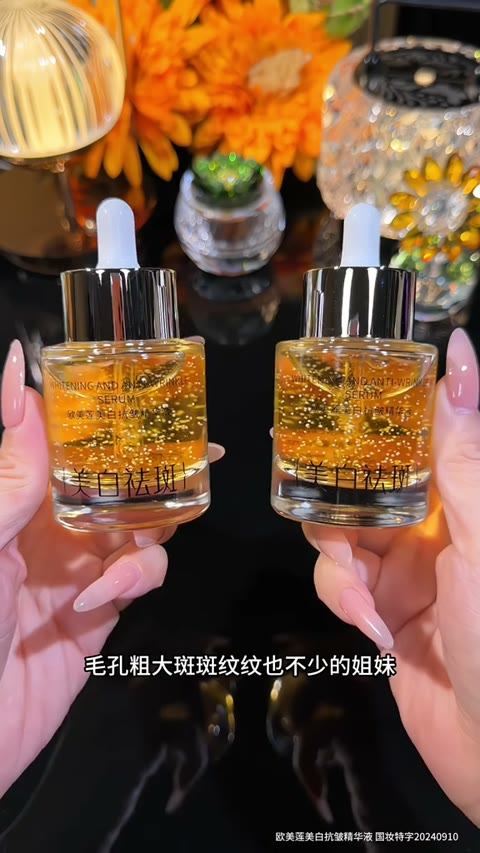

画面描述：镜头转向脸部、手背、局部皮肤或场景效果，表现使用前后的氛围变化。

分镜脚本：使用效果：镜头转向脸部、手背、局部皮肤或场景效果，表现使用前后的氛围变化。建议保持 1.5-2 秒节奏，动作不要过满，重点放在产品、手部和质感变化上。

AI提示词：@xxx效果展示镜头，肤色干净通透，妆效自然，画面明亮柔和，人物状态精致不夸张，竖屏9:16，微距特写，浅景深，产品/膏霜位置使用@xxx，真实商业美妆短视频风格，高清细节，皮肤质感自然，光线柔和通透，色彩干净高级，背景不杂乱，动作连贯自然，负面：低清晰度、畸形手、过度磨皮、脏乱背景、文字水印、logo乱码、过曝、塑料感。整段视频不要出现任何字幕

### 镜头 10｜约 18s｜使用效果
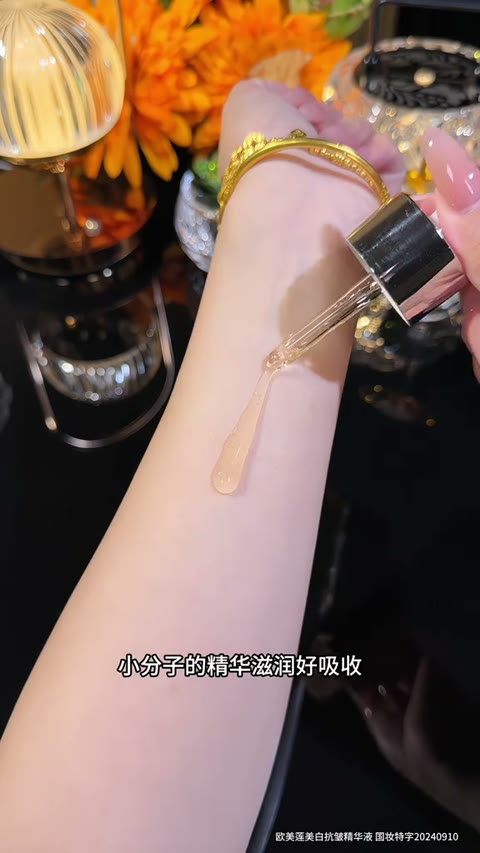

画面描述：镜头转向脸部、手背、局部皮肤或场景效果，表现使用前后的氛围变化。

分镜脚本：使用效果：镜头转向脸部、手背、局部皮肤或场景效果，表现使用前后的氛围变化。建议保持 1.5-2 秒节奏，动作不要过满，重点放在产品、手部和质感变化上。

AI提示词：@xxx效果展示镜头，肤色干净通透，妆效自然，画面明亮柔和，人物状态精致不夸张，竖屏9:16，中近景，轻微手持运动，产品/膏霜位置使用@xxx，真实商业美妆短视频风格，高清细节，皮肤质感自然，光线柔和通透，色彩干净高级，背景不杂乱，动作连贯自然，负面：低清晰度、畸形手、过度磨皮、脏乱背景、文字水印、logo乱码、过曝、塑料感。整段视频不要出现任何字幕

### 镜头 11｜约 20s｜氛围补充
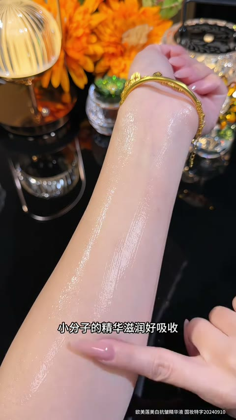

画面描述：用环境、道具、花材、桌面、布景或生活方式镜头补足品牌调性。

分镜脚本：氛围补充：用环境、道具、花材、桌面、布景或生活方式镜头补足品牌调性。建议保持 1.5-2 秒节奏，动作不要过满，重点放在产品、手部和质感变化上。

AI提示词：@xxx生活方式氛围镜头，桌面陈列精致，道具简洁，暖色自然光，轻奢美妆视觉风格，竖屏9:16，俯拍或侧拍，构图留白干净，产品/膏霜位置使用@xxx，真实商业美妆短视频风格，高清细节，皮肤质感自然，光线柔和通透，色彩干净高级，背景不杂乱，动作连贯自然，负面：低清晰度、畸形手、过度磨皮、脏乱背景、文字水印、logo乱码、过曝、塑料感。整段视频不要出现任何字幕

### 镜头 12｜约 22s｜氛围补充
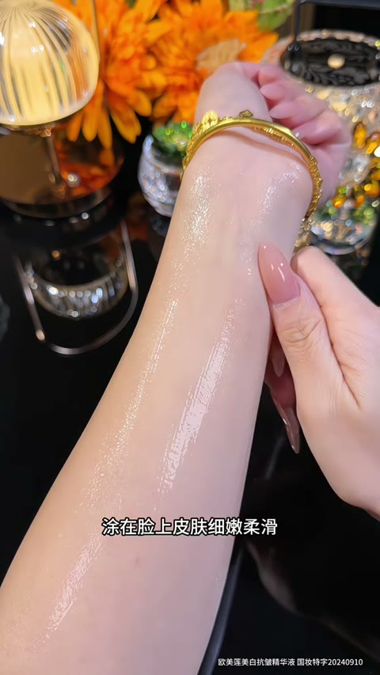

画面描述：用环境、道具、花材、桌面、布景或生活方式镜头补足品牌调性。

分镜脚本：氛围补充：用环境、道具、花材、桌面、布景或生活方式镜头补足品牌调性。建议保持 1.5-2 秒节奏，动作不要过满，重点放在产品、手部和质感变化上。

AI提示词：@xxx生活方式氛围镜头，桌面陈列精致，道具简洁，暖色自然光，轻奢美妆视觉风格，竖屏9:16，微距特写，浅景深，产品/膏霜位置使用@xxx，真实商业美妆短视频风格，高清细节，皮肤质感自然，光线柔和通透，色彩干净高级，背景不杂乱，动作连贯自然，负面：低清晰度、畸形手、过度磨皮、脏乱背景、文字水印、logo乱码、过曝、塑料感。整段视频不要出现任何字幕

### 镜头 13｜约 24s｜卖点强化
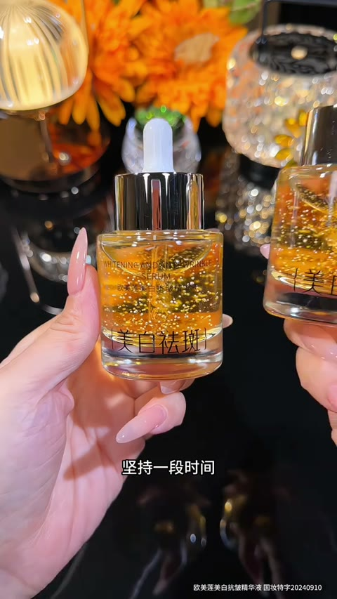

画面描述：回到核心动作或核心细节，重复强化产品记忆点，让画面更有转化感。

分镜脚本：卖点强化：回到核心动作或核心细节，重复强化产品记忆点，让画面更有转化感。建议保持 1.5-2 秒节奏，动作不要过满，重点放在产品、手部和质感变化上。

AI提示词：@xxx卖点强化特写，产品与使用动作同框，画面重点集中，清晰表现质感、颜色和使用体验，竖屏9:16，中近景，轻微手持运动，产品/膏霜位置使用@xxx，真实商业美妆短视频风格，高清细节，皮肤质感自然，光线柔和通透，色彩干净高级，背景不杂乱，动作连贯自然，负面：低清晰度、畸形手、过度磨皮、脏乱背景、文字水印、logo乱码、过曝、塑料感。整段视频不要出现任何字幕

### 镜头 14｜约 26s｜卖点强化
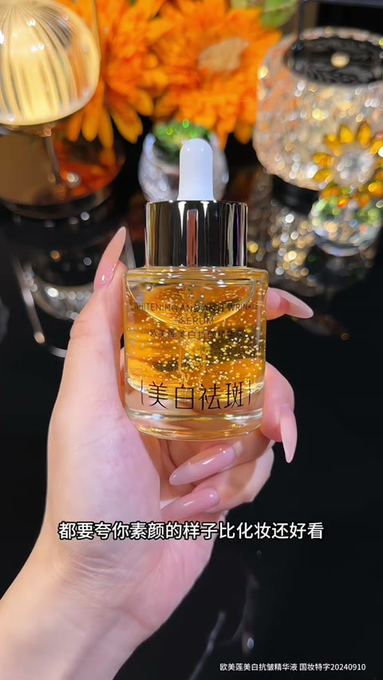

画面描述：回到核心动作或核心细节，重复强化产品记忆点，让画面更有转化感。

分镜脚本：卖点强化：回到核心动作或核心细节，重复强化产品记忆点，让画面更有转化感。建议保持 1.5-2 秒节奏，动作不要过满，重点放在产品、手部和质感变化上。

AI提示词：@xxx卖点强化特写，产品与使用动作同框，画面重点集中，清晰表现质感、颜色和使用体验，竖屏9:16，俯拍或侧拍，构图留白干净，产品/膏霜位置使用@xxx，真实商业美妆短视频风格，高清细节，皮肤质感自然，光线柔和通透，色彩干净高级，背景不杂乱，动作连贯自然，负面：低清晰度、畸形手、过度磨皮、脏乱背景、文字水印、logo乱码、过曝、塑料感。整段视频不要出现任何字幕

### 镜头 15｜约 28s｜收尾定格
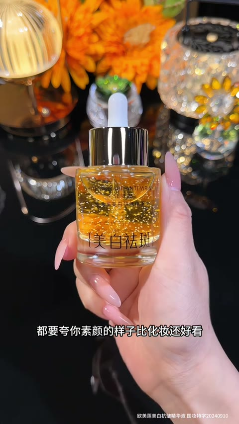

画面描述：用产品定格、人物满意状态或整套陈列结束，形成干净的广告收尾。

分镜脚本：收尾定格：用产品定格、人物满意状态或整套陈列结束，形成干净的广告收尾。建议保持 1.5-2 秒节奏，动作不要过满，重点放在产品、手部和质感变化上。

AI提示词：@xxx广告收尾定格，产品居中摆放或手持展示，构图完整，高级干净，适合短视频结尾，竖屏9:16，稳定定格，适合结尾停留，产品/膏霜位置使用@xxx，真实商业美妆短视频风格，高清细节，皮肤质感自然，光线柔和通透，色彩干净高级，背景不杂乱，动作连贯自然，负面：低清晰度、畸形手、过度磨皮、脏乱背景、文字水印、logo乱码、过曝、塑料感。整段视频不要出现任何字幕
